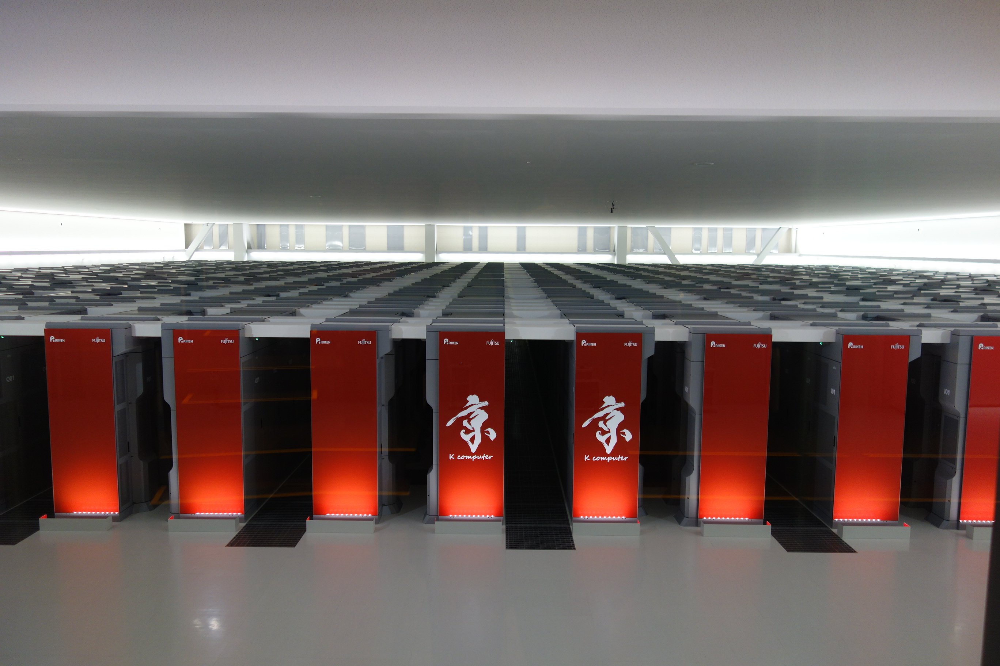

name: title-layout
layout: true
class: center, middle, title
---
name: basic-layout
layout: true
class: left, top

---
name: new-beginnings
template: title-layout

---
name: supercomputing
tempalte: title-layout
## HPC? Supercomputing?
#### Use big computers to run important calculations that run super fast.

---
name: new-beginnings
template: title-layout

---
name: what-we-do
template: basic-layout
## What do we do?
- Participate in international Student Cluster Competitions
- Part of the Boston Area HPC Interest Group
- Part of the BU Spark Ignite initiative
- Work on other cool side projects
- Collaborate with other student HPC groups from NEU, MIT, UMass etc.

---
name: the-beginnings
template: title-layout
## The Beginnings
#### Team Chowdah leveraging "Human Parallelism"

---
name: the-beginnings-2
tempalte: title-layout
.center[]
???
- MGHPCC, but we were really "green" in both senses of the word
- SC11 and 12
- underdog team and we still finished fourth!
- frathest back I could trace when we participated
- from the days of AMD-GF split and AbuDhabi core based opteron servers
- NV tesla K10s (cutting edge at the time and we still saw >100% perf jumps every generation)
- This team had stuff that was not even released yet!
- Placed second once!
- Silicon Mechanics donated a large cluster to the team

---
name: golden-days-2
template: title-layout
.center[]
???
- Went on to participate in many competitions under the banner of MGHPCC
- Team was still a collaboration between Boston area universities
- ASC qualifying - top 16 both years
- Only American team for ASC'16
- SC'16 we did really well on research paper reimplementation

---
name: attended
layout: basic-layout
- SC'11
- SC'12
- SC'14
- ASC'15
- ISC'16
- SC'16
- ASC'16

---
name: hiatus
template: title-slide
### And everything just...stopped?

---
name: resurrection
### BUHPC v2.0 lives on

---
name: whats-next
template: basic-layout
## What's next?
- Forming teams for ASC'19
- BUHPC Invitational
- Quarrel or Collaboration: TrackML

---
name: what-is-scc
template: basic-layout
## What does SCC entail?
- 4-6 HPC codes to optimize and use as benchmarks
- Code is generally given
- Cluster specific optimizations required
- Power limit of 3kW
- HPC benchmarks
- Research paper reproduction
- Deep learning or machine learning codes
- Monkeywrench challanges (e.g. powerloss)
- Hardware is open ended!
